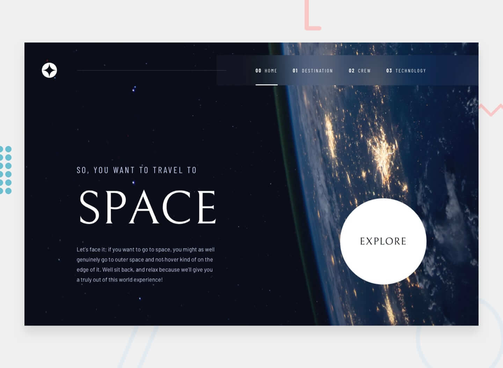

# Página de Turismo Espacial

Este proyecto recrea una página web de turismo espacial, en la cual se presenta los destinos disponibles, la tripulación que acompañara a los turistas y la tecnología utilizada para el viaje.

El proyecto está hecho con TailwindCSS para la maquetación y JavaScript para la interactividad.



## Requisitos previos

Antes de comenzar, asegúrate de tener instalado `npm` en tu sistema. Si no lo tienes instalado, puedes descargarlo e instalarlo desde [el sitio web oficial de Node.js](https://nodejs.org/).

## Instalación

1. Clona este repositorio en tu máquina local o descargar la carpeta comprimida del proyecto:

   ```bash
   git clone https://github.com/drifterDev/turismo-espacial.git
2. Descargar las dependencias nesesarias del proyecto:

   ```bash
   npm install
3. Correr el comando para generar el CSS debido al framework TailwindCSS:

   ```bash
   npm run build
4. El archivo principal o punto de entrada es home.html, pero se puede acceder mediante los demas archivos .html.

5. Abrir un servidor local o utilizar la extensión Live Server. Debido a que dentro del proyecto se utiliza async-await en archivos locales y esto es bloqueado por los navegadores.

6. (Si se utiliza Live Server, esto no es nesesario) Instalar http-server

   ```bash
   npm install -g http-server
7. Ir a la carpeta src/ y dentro de esta ejecutar lo siguiente
   ```bash
   http-server -p 8080 -o /home.html
8. Al hacer esto se debería abrir automaticamente en el navegador el servidor con la pagina web ya cargada y si no, entonces fijarse en la siguiente salida.

   ```bash
   Starting up http-server, serving ./
   Available on:
    http://127.0.0.1:8080
    http://192.168.1.100:8080
9. Abrir el navegador de preferencia e ir a cualquiera de las direcciones que fueron proporcionadas.

## Contribuciones

Aprecio cualquier sugerencia para mejorar el contenido de este proyecto. Si deseas contribuir, por favor crea un "issue" en el repositorio o contáctame directamente. Valoraré tus aportes para mejorar este repositorio.

## Licencia

Los códigos incluidos en este proyecto están bajo la Licencia MIT. Para obtener más información, consulta el archivo "LICENSE" en la raíz del repositorio.
